# Karban

**Hospodský roguelike se žolíky.** Skládej pokerové kombinace, sbírej žolíky s podivnými schopnostmi,
přežij Kontrolu z finančáku i Souseda s vrtačkou a vyhraj osm pater čím dál šílenějších útrat. Celé
česky, v prohlížeči, bez instalace a bez reklam na půjčky.

> Inspirováno hrou Balatro. Mechaniky jsme obdivovali, ale názvy, texty, obrázky, zvuky i čísla jsme si
> vymysleli sami.

**Hraj v prohlížeči:** [radecek147.github.io/FM](https://radecek147.github.io/FM/) — odkaz začne fungovat,
jakmile se v repozitáři zapnou GitHub Pages (viz [Nasazení](#nasazení)). Po prvním načtení jde hra i offline.

<p align="center">
  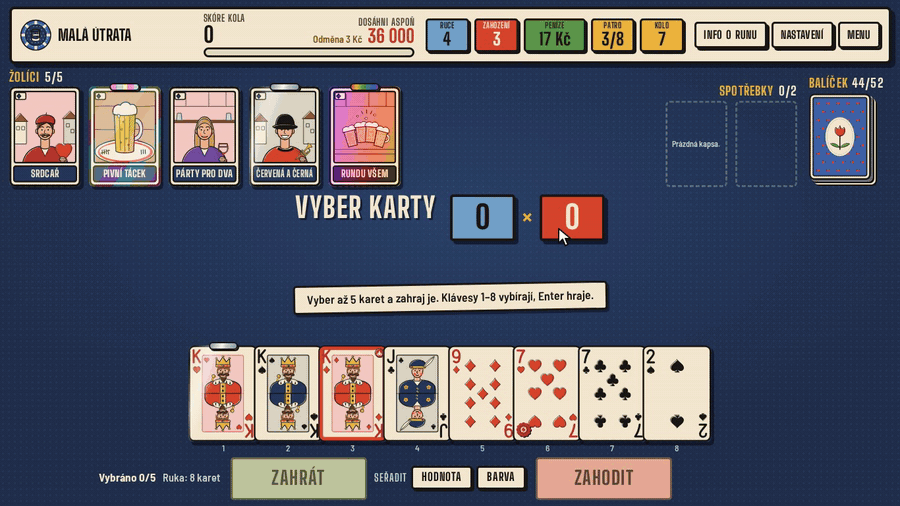
</p>

## Obsah

- [Jak to vypadá](#jak-to-vypadá)
- [Jak hrát](#jak-hrát)
- [Ovládání](#ovládání)
- [Co ve hře najdeš](#co-ve-hře-najdeš)
- [Hra pro macOS (.dmg)](#hra-pro-macos-dmg)
- [Spuštění](#spuštění)
- [Vývoj](#vývoj)
- [Nasazení](#nasazení)
- [Licence a atribuce](#licence-a-atribuce)
- [Poděkování](#poděkování)

## Jak to vypadá

| Hlavní menu                                                             | Výběr útraty: na konci patra čeká šéf                                               |
| ----------------------------------------------------------------------- | ----------------------------------------------------------------------------------- |
| 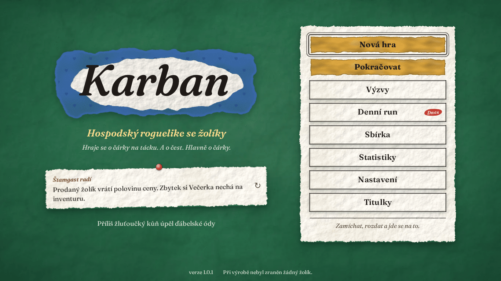                | 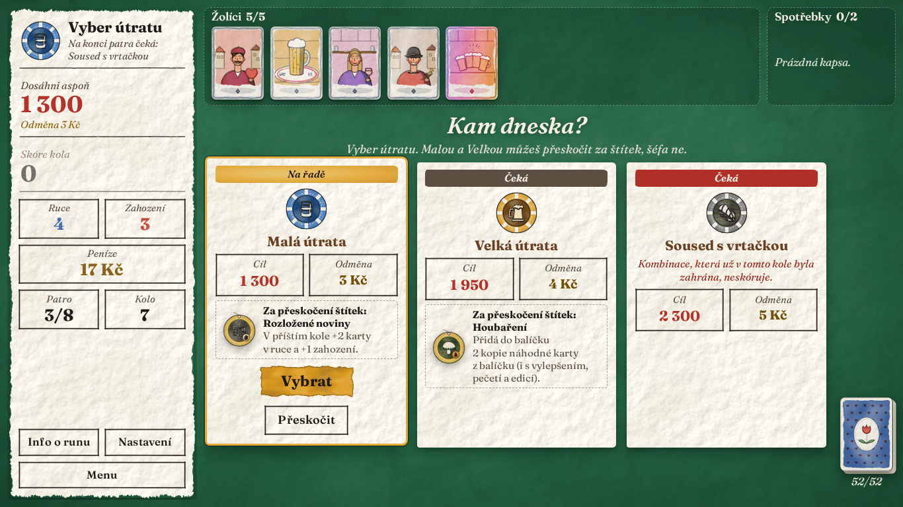 |
| **Kolo: vybraný Full house a živé čipy × mult**                         | **Skórování v plném proudu**                                                        |
| 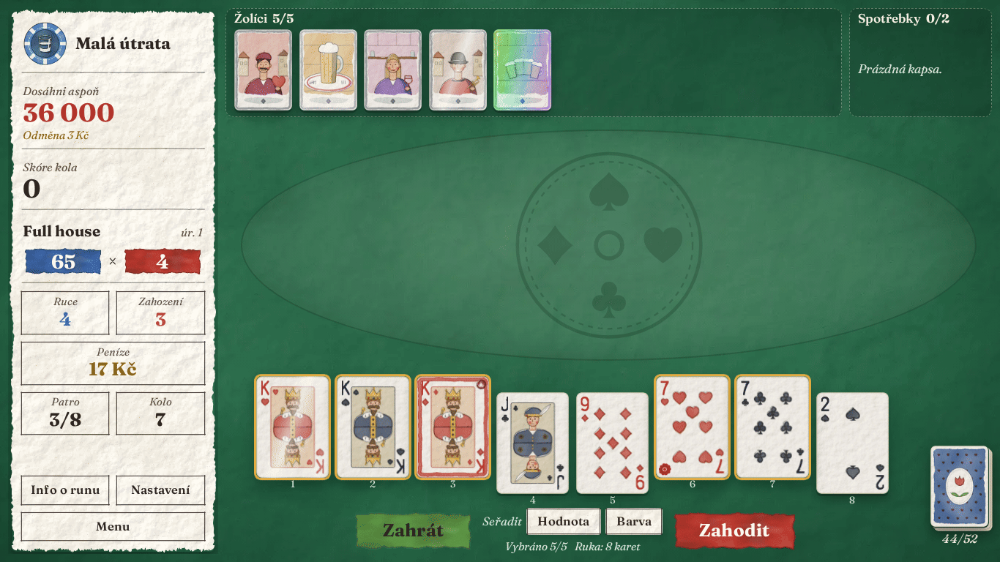 | 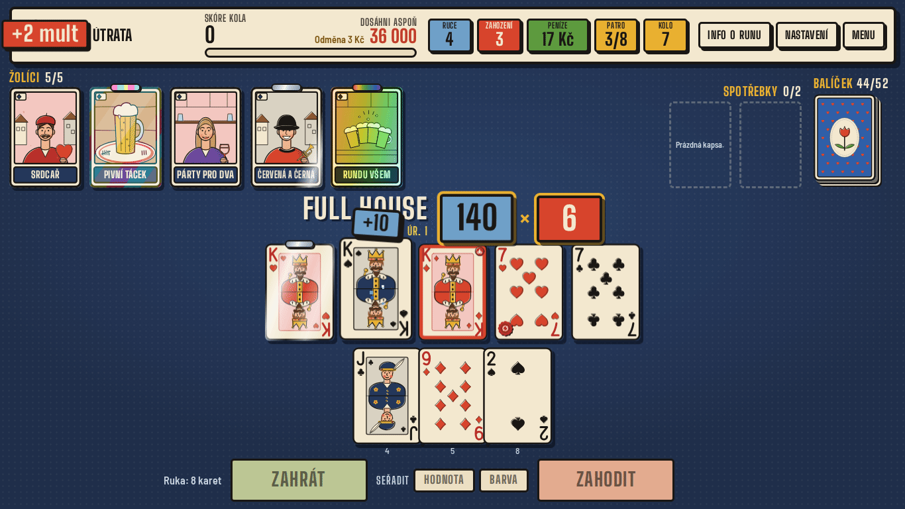               |
| **Večerka**                                                             | **Tlustá obálka babských rad**                                                      |
| 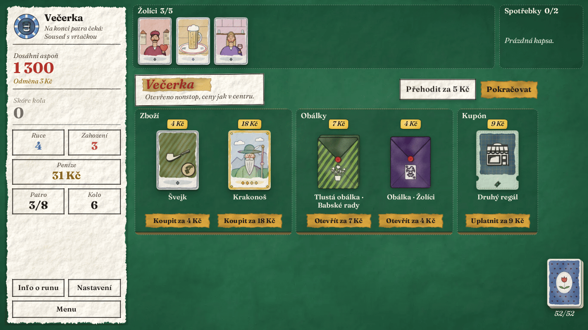     | 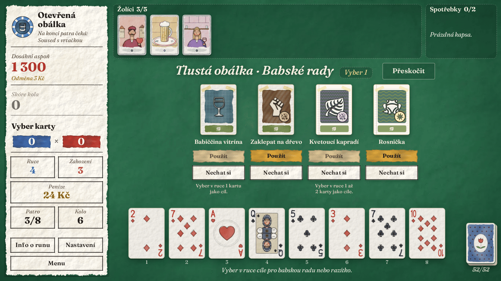                       |
| **Sbírka**                                                              | **Statistiky**                                                                      |
| 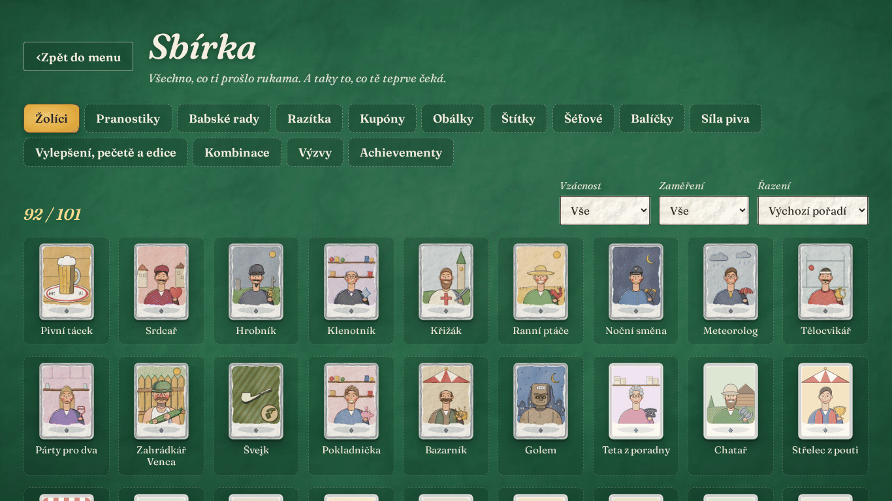                     | 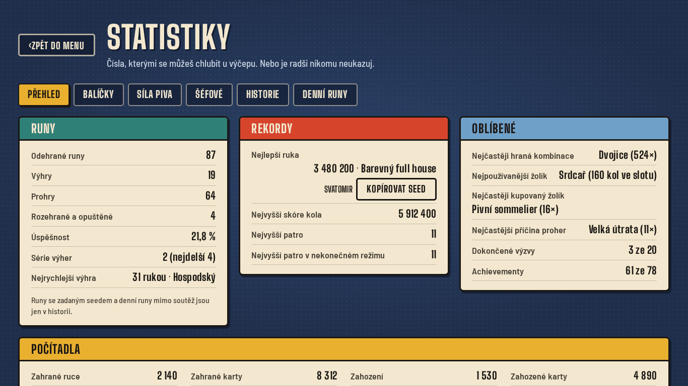         |
| **Achievementy**                                                        | **Pitva po prohraném runu**                                                         |
| 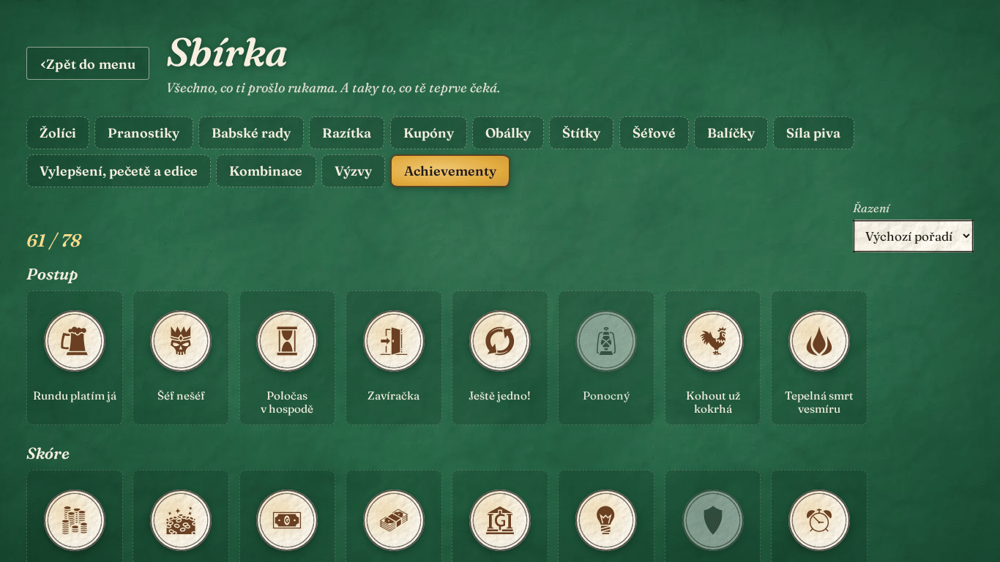               | 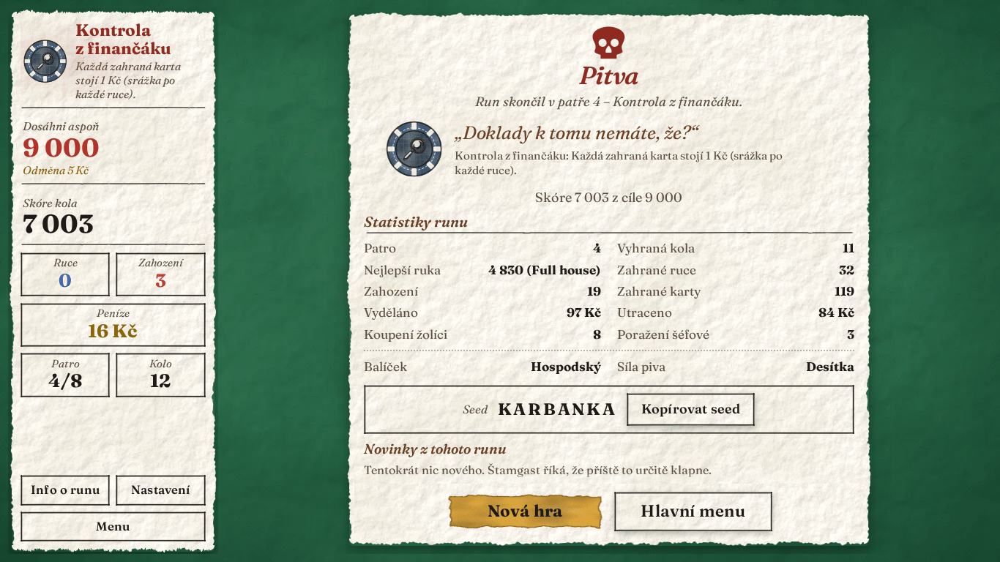                     |
| **Barvoslepý režim (čtyřbarevný balíček)**                              |                                                                                     |
| 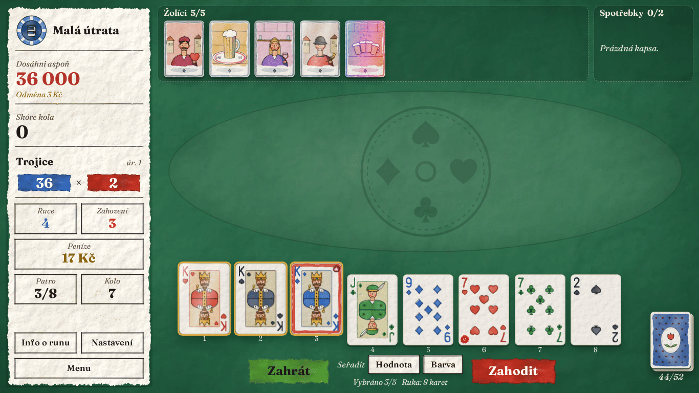          |                                                                                     |

## Jak hrát

Jeden run má **8 pater**. V každém patře tě čekají tři útraty: **Malá** (cíl 1×), **Velká** (1,5×)
a **Šéf** (2× a k tomu zlomyslné pravidlo). Malou a Velkou můžeš přeskočit — přijdeš o odměnu,
ale dostaneš **štítek** s bonusem. Když cíl kola nedáš, run končí a následuje **pitva** s hláškou podle
toho, co tě dostalo. Po osmém patře přijde výhra, titulky a nabídka **Nekonečného režimu**, kde cíle
rostou, dokud nepadneš.

**Kolo.** Máš 4 ruce, 3 zahození a 8 karet v ruce (žolíci, kupóny a balíčky to mění). Zahraješ 1–5
karet a skóruje nejvyšší kombinace, kterou tvoří. Karty mimo kombinaci se nepočítají, pokud to žolík
neurčí jinak.

**Kombinace:** Vysoká karta, Dvojice, Dvě dvojice, Trojice, Postupka (i A-2-3-4-5), Barva, Full house,
Čtveřice, Postupka v barvě, Královská postupka — a tři tajné, které se odemknou, až je poprvé zahraješ:
Pětice, Barevný full house a Barevná pětice. Každá kombinace má úroveň, kterou zvedají **pranostiky**.

**Skóre = čipy × mult.** Vyhodnocuje se vždy ve stejném pořadí:

1. základ kombinace podle její úrovně,
2. každá skórující karta zleva doprava: čipy karty → vylepšení → edice → pečeť → žolíci, kteří reagují
   na skórovanou kartu,
3. karty, které ti zůstaly v ruce (třeba ocelové),
4. žolíci zleva doprava (+čipy, +mult, ×mult).

**Na pořadí žolíků záleží.** ×mult na konci řady násobí všechno, co se nasbíralo před ním. Žolíky
přesouváš tažením a kliknutím otevřeš detail, kde je jde i prodat. Čísla rostou do statisíců a milionů,
s dobrou sestavou i mnohem výš.

**Peníze** jsou v korunách. Za vyhrané kolo dostaneš 3, 4 nebo 5 Kč, korunu za každou nevyužitou ruku
a úrok 1 Kč z každých 5 Kč na účtu (strop 5 Kč, kupóny ho zvednou).

**Večerka** (obchod mezi koly) nabízí dva sloty zboží (žolíci, spotřebky, hrací karty), dvě **obálky**
(vybíráš si z nich), jeden **kupón** s trvalým vylepšením na celý run a tlačítko **Přehodit**, které
s každým použitím zdraží. Žolíky a spotřebky prodáš za polovinu ceny.

**Spotřebky** máš ve dvou slotech a jsou tři druhy:

- **Pranostiky** zvednou úroveň kombinace („Medardova kápě“ a spol.),
- **Babské rady** upravují hrací karty — vylepšení, změna barvy nebo hodnoty, kopie, zničení, peníze,
- **Úřední razítka** jsou vzácná a silná, ale něco stojí.

**Šéfové** mají každý jedno jasné pravidlo: zakryté karty, debuffnutá barva, zákaz opakovat kombinaci,
poplatek za každou ruku… V osmém patře čeká jeden z pěti **finálových šéfů**, kteří jsou ještě o kus
horší.

**Síla piva** je obtížnost: Desítka, Jedenáctka, Dvanáctka, Speciál, Ležák, Bock, Doppelbock
a Imperial. Každá přidá ke ztížením předchozích úrovní jedno nové (například dražší Večerku, rychleji rostoucí
cíle nebo šéfovo pravidlo i ve Velké útratě). Výhra na jedné síle odemkne další.

Kromě běžné hry je tu **12 startovních balíčků** s vlastními pravidly, **20 výzev**, **denní run** (stejný
seed pro všechny), **seedované runy**, **sbírka** se vším, co jsi objevil, **statistiky**, **historie runů**
a **achievementy**. První run tě provede **Štamgast** — rady jdou přeskočit a kdykoli znovu zapnout
v Nastavení.

## Ovládání

Hraje se myší, prstem i klávesnicí.

| Klávesa             | Co udělá                                                  |
| ------------------- | --------------------------------------------------------- |
| `1`–`8`             | vybrat nebo odznačit kartu na dané pozici v ruce (max. 5) |
| `Enter`             | zahrát vybrané karty                                      |
| `X`                 | zahodit vybrané karty                                     |
| `S` / `B`           | seřadit ruku podle hodnoty / podle barvy                  |
| `Shift` + `←` / `→` | posunout vybranou kartu v ruce doleva / doprava           |
| `Mezerník`          | přeskočit běžící animaci                                  |
| `M`                 | ztlumit nebo zase pustit zvuk (kdekoli ve hře)            |
| `Esc`               | menu nebo zavřít dialog                                   |
| `Tab`               | přejít na další tlačítko                                  |

Myší nebo prstem kartu vybereš klepnutím, karty v ruce i žolíky přesuneš tažením. V **Nastavení** najdeš
hlasitost efektů a hudby, rychlost hry 1×–4×, vypnutí animací a třesení obrazovky, celou obrazovku,
barvoslepý režim, velikost rozhraní a export a import uložení. Hra se ukládá sama po každé akci.

## Co ve hře najdeš

Počty jsou spočítané z registru obsahu (`src/content`):

| Co                      | Kolik | Podrobnosti                                                                                                                         |
| ----------------------- | ----: | ----------------------------------------------------------------------------------------------------------------------------------- |
| Žolíci                  |   101 | 44 běžných, 32 vzácných, 17 epických, 8 legendárních                                                                                |
| Šéfové                  |    30 | 25 běžných a 5 finálových pro 8. patro                                                                                              |
| Štítky za přeskočení    |    20 |                                                                                                                                     |
| Spotřebky               |    51 | 13 pranostik (jedna na každou kombinaci), 22 babských rad, 16 úředních razítek                                                      |
| Obálky                  |    15 | 5 druhů (pranostiky, babské rady, razítka, žolíci, hrací karty) × Obálka, Tlustá obálka, Krabice od bot                             |
| Kupóny                  |    24 | 12 párů základ → vylepšení                                                                                                          |
| Startovní balíčky       |    12 | Hospodský, Štamgastův, Úřednický, Turistický, Mariášový, Obrázkový, Notářský, Zbohatlík, Dlužník, Babiččin, Vetešnický, Kalendářový |
| Síla piva (obtížnosti)  |     8 | Desítka → Imperial                                                                                                                  |
| Výzvy                   |    20 |                                                                                                                                     |
| Achievementy            |    78 |                                                                                                                                     |
| Kombinace               |    13 | 10 běžných a 3 tajné                                                                                                                |
| Vylepšení hracích karet |     9 | Prémiová, Pálivá, Skleněná, Ocelová, Kamenná, Zlatá, Šťastná, Divoká, Ohmataná                                                      |
| Pečetě                  |     4 | zlatá, červená, modrá, fialová                                                                                                      |
| Edice                   |     4 | Lesklá, Holografická, Duhová, Negativní                                                                                             |

Figury jsou Kluk, Dáma a Král; žádný text, obrázek ani číslo není převzaté z Balatra ani jiné komerční
hry.

## Hra pro macOS (.dmg)

Karban jde hrát i jako běžná aplikace pro macOS (Apple Silicon i Intel, macOS 11 a novější) — bez prohlížeče,
Node.js a Terminálu. Aplikace je hra zabalená přes [Tauri](https://tauri.app/) do okna se systémovým WebView.

**Stažení:** `.dmg` sestavuje GitHub Actions ([.github/workflows/desktop.yml](.github/workflows/desktop.yml)).
Je přiložený k [vydání (Releases)](https://github.com/radecek147/FM/releases), a když vydání ještě není, najdeš ho
v záložce **Actions → Desktop (macOS .dmg)** u posledního běhu v části **Artifacts** („Karban-macOS“, stáhne se
jako ZIP s `.dmg` uvnitř; vyžaduje přihlášení na GitHub).

**Instalace:** otevři `.dmg` a přetáhni **Karban** do složky **Aplikace**.

**První spuštění:** aplikace není podepsaná účtem Apple Developer, takže ji macOS napoprvé odmítne s hláškou, že
nemůže ověřit vývojáře. Stačí jednou:

1. Zkus Karban spustit (dvojklik) a hlášku zavři.
2. Otevři **Nastavení systému → Soukromí a zabezpečení**, sjeď dolů a u zprávy o Karbanu klikni na
   **Přesto otevřít** a potvrď heslem.

Pak už se spouští normálně. Kdyby macOS hlásil, že je aplikace „poškozená“, pomůže v Terminálu
`xattr -dr com.apple.quarantine /Applications/Karban.app`.

Uložené hry aplikace drží zvlášť od prohlížeče; přenést je jde přes **Nastavení → Exportovat / Importovat
uložení** (v aplikaci se otevře normální dialog pro uložení souboru).

## Spuštění

Potřebuješ [Node.js](https://nodejs.org/) **20 nebo novější** (s ním přijde i `npm`) a Git.

- **Mac:** Node stáhni jako instalátor z nodejs.org (verze LTS) nebo `brew install node`. Příkazy níže
  píšeš do aplikace **Terminál** (Cmd + mezerník → „Terminál“).
- **Windows:** Node stáhni z nodejs.org (LTS) nebo `winget install OpenJS.NodeJS.LTS`. Příkazy píšeš do
  **PowerShellu** nebo **Windows Terminálu**.
- **Linux:** Node z balíčků distribuce nebo přes `nvm`.

```bash
git clone https://github.com/radecek147/FM.git
cd FM
npm install
npm run dev
```

Pak otevři adresu, kterou vypíše Vite (obvykle <http://localhost:5173>). Produkční build si vyzkoušíš
přes `npm run build && npm run preview` (<http://localhost:4173>). Hra nepotřebuje síť ani server — všechny
assety jsou v repozitáři.

## Vývoj

**Vite + TypeScript (strict)**, žádný framework: UI je vlastní tenká vrstva nad DOM a CSS, částice kreslí
jeden `<canvas>`. Engine je čistý TypeScript bez DOM, deterministický (všechna náhoda jde přes seedované
RNG) a řízený událostmi — UI jen poslouchá a vykresluje.

| Příkaz                                     | Co dělá                                                               |
| ------------------------------------------ | --------------------------------------------------------------------- |
| `npm run dev`                              | vývojový server s hot reloadem                                        |
| `npm run build`                            | produkční build do `dist/` (včetně service workeru pro offline)       |
| `npm run preview`                          | náhled produkčního buildu                                             |
| `npm test`                                 | unit testy (Vitest); `npm run test:coverage` s pokrytím               |
| `npm run test:e2e`                         | e2e testy (Playwright); poprvé `npx playwright install chromium`      |
| `npm run typecheck`                        | kontrola typů                                                         |
| `npm run lint`                             | ESLint + Prettier (`npm run format` opraví formátování)               |
| `npm run fetch-assets`                     | stáhne písmo a ikony do `src/assets/` a vygeneruje `ASSETS.md`        |
| `npm run simulate -- --runs 500 --stake 1` | boti odehrají runy bez UI: výhry podle patra, příčiny proher, žolíci  |
| `npm run simulate -- --play [--seed …]`    | textový režim — celý run zahraješ v terminálu                         |
| `npm run deploy`                           | build + kontrola a návod k nasazení na GitHub Pages                   |
| `npx tsx scripts/readme-media.ts`          | znovu vyfotí snímky a GIF do `docs/media/` (potřebuje `ffmpeg`)       |
| `npx tsx scripts/ui-walkthrough.ts`        | bot projde celý run přes UI a porovnává ho s enginem (běžící preview) |

Simulace bere i `--deck`, `--bot max,flush,pairs,econ`, `--seed-prefix` a `--json`; textový režim
`--deck`, `--stake` a `--script` s předepsanými tahy.

```
src/
  engine/     pravidla, stav, skórování, RNG, uložení a profil — bez DOM
              (cards/ hands/ scoring/ run/ shop/ effects/ rng/ save/ meta/ sim/)
  content/    data: žolíci, šéfové, spotřebky, kupóny, štítky, obálky, balíčky, síla piva, výzvy, achievementy
  ui/         obrazovky, animace, částice, zvuk (Web Audio), procedurální SVG grafika (ui/art)
  i18n/       cs.ts + cs/* (všechny texty hry), format.ts (čísla, skloňování)
  assets/     písmo a ikony
  sw/         service worker (offline)
scripts/      fetch-assets, simulate, deploy, readme-media, ui-walkthrough, joker-value
tests/        unit (Vitest) a e2e (Playwright)
docs/         dokumentace a media/ se snímky do README
```

Dokumentace:

- [docs/ARCHITECTURE.md](docs/ARCHITECTURE.md) — jak je to postavené (engine, události, UI, ukládání, výkon)
- [docs/DESIGN.md](docs/DESIGN.md) — kompletní herní design s tabulkami čísel
- [docs/DECISIONS.md](docs/DECISIONS.md) — deník rozhodnutí (co, kdy a proč)
- [docs/CONTENT-GUIDE.md](docs/CONTENT-GUIDE.md) — jak přidat žolíka, šéfa nebo výzvu
- [docs/IDEAS.md](docs/IDEAS.md) — nápady na další obsah
- [ROADMAP.md](ROADMAP.md) — plán po fázích a aktuální stav
- [ASSETS.md](ASSETS.md) — původ a licence všech assetů

Nový žolík = jeden objekt v `src/content/jokers/` (soubory podle vzácnosti), texty v `src/i18n/cs/jokers/`
a test. Podrobnosti v CONTENT-GUIDE.

## Nasazení

Hra se nasazuje na **GitHub Pages** přes GitHub Actions
([.github/workflows/deploy.yml](.github/workflows/deploy.yml)): po každém pushi do `main`, po tagu `v*`
(třeba `v1.0.0`) nebo ručně v záložce Actions. Workflow spustí testy, sestaví hru s `BASE_PATH=/<repozitář>/`
a nahraje `dist/`.

Jednorázově je potřeba v repozitáři zapnout Pages: **Settings → Pages → Source = GitHub Actions**. Aby šly
nasazovat i tagy, povol je v **Settings → Environments → github-pages → Deployment branches and tags**
(pravidlo `v*`). Hra pak poběží na <https://radecek147.github.io/FM/>.

Lokální náhled se stejnou cestou jako na Pages: `BASE_PATH=/FM/ npm run build && npm run preview`.

### Desktopová aplikace

`npm run desktop:dev` otevře hru v okně aplikace (potřebuje [Rust](https://rustup.rs/) a na Linuxu knihovny
WebKitGTK), `npm run desktop:build` sestaví aplikaci pro aktuální systém. `.dmg` pro macOS sestavuje workflow
**Desktop (macOS .dmg)** — ručně v záložce Actions, nebo samo po zveřejnění vydání (pak `.dmg` přiloží k vydání).
Ikony aplikace se generují z `src-tauri/icon.svg` příkazem `npm run desktop:icon`.

## Licence a atribuce

- **Kód** je pod licencí [MIT](LICENSE).
- **Písmo** [Pixelify Sans](https://github.com/eifetx/Pixelify-Sans) — Stefie Justprince, © 2021 The
  Pixelify Sans Project Authors, licence SIL Open Font License 1.1 (`src/assets/fonts/OFL.txt`).
- **Ikony** z [game-icons.net](https://game-icons.net) — autoři Delapouite, Lorc, Skoll, Sbed, Caro Asercion,
  Faithtoken, Guard13007, Cathelineau a Willdabeast, licence
  [CC BY 3.0](https://creativecommons.org/licenses/by/3.0/). Ikony jsou přebarvené a skládané do obrázků
  karet; zůstávají pod CC BY 3.0. Rozpis ikon podle autorů je v [ASSETS.md](ASSETS.md).
- **Hrací karty, obrázky žolíků, šéfů a dalších karet, zvukové efekty i hudba** vznikají přímo v kódu
  (procedurální SVG, syntezátor ve Web Audio) a patří pod licenci projektu.
- **Žádné assety, texty, jména ani čísla z Balatra** ani jiné komerční hry. Balatro je jen inspirace
  mechanikami.

Atribuce najdeš i ve hře v **Titulcích**.

## Poděkování

- Paní hostinské, že nezhasla, dokud nedoběhly testy.
- Babičce za pranostiky. Vyplnily se všechny, jen trochu jinak.
- Sousedovi s vrtačkou za rytmus, podle kterého se ladily animace skórování.
- Panu starostovi, že hru zatím nezakázal vyhláškou.
- Kontrole z finančáku, že si to přečte až po vydání.
- Tobě, že jsi dočetl až sem. Teď už fakt běž hrát — Malá útrata se sama nezaplatí.
